<p align="center">
  <picture>
    <source media="(prefers-color-scheme: dark)" srcset="assets/brand/oow-lockup-dark.svg">
    
  </picture>
</p>

<h1 align="center">Out of Windows</h1>

<p align="center">
  <b>A terminal-first maintenance toolkit for Windows.</b><br>
  Clean caches and temp files, uninstall apps completely, see what fills your disk, and check
  your system's health — with every deletion previewed, confirmed and verified.
</p>

<p align="center">
  <a href="https://github.com/Harshul1484/out-of-windows/actions/workflows/ci.yml"></a>
  <a href="https://github.com/Harshul1484/out-of-windows/releases/latest"></a>
  
  <a href="LICENSE"></a>
</p>

```powershell
irm https://raw.githubusercontent.com/Harshul1484/out-of-windows/main/scripts/install.ps1 | iex
```

<p align="center">
  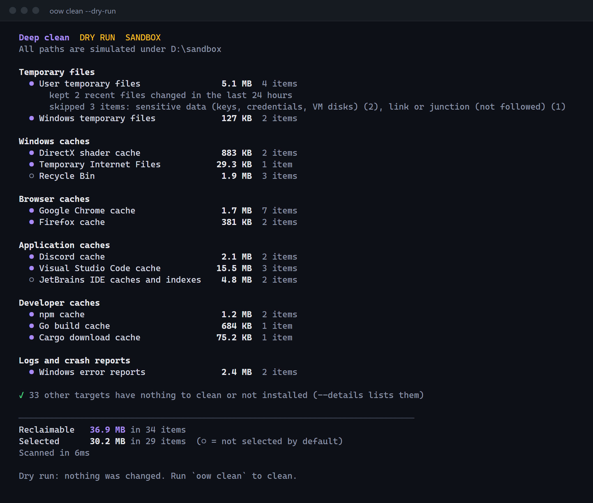
</p>

<p align="center"><sub>Every screenshot in this README is the real CLI, captured in <code>oow</code>'s sandbox (a simulated Windows layout), so paths and sizes are sample data.</sub></p>

---

## What it does

`oow` is one small, self-contained `.exe`. It finds what is using your machine, removes what is
known to be safe to remove, and explains every step. It never asks for administrator rights as
a whole, and it never changes anything you did not confirm.

| Capability | Commands |
|---|---|
| **Cleanup** — temp files, Windows, browser, app and developer caches, logs, the Recycle Bin | `clean` |
| **Complete uninstall** — runs the app's own uninstaller, verifies it, then finds what it left behind | `uninstall`, `leftovers` |
| **Disk analysis** — an interactive explorer and the largest files on any drive | `analyze` |
| **Live status** — CPU, GPU, memory, disk, network and the busiest processes | `status`, `processes` |
| **Developer cleanup** — rebuildable `node_modules`, `target`, `.venv`, `bin`/`obj`… and forgotten installers | `purge`, `installer` |
| **Diagnostics and fixes** — health checks, startup programs, bounded maintenance, PATH repair | `doctor`, `startup`, `optimize`, `repair` |
| **Keep it current** — verified self-update and clean self-removal | `update`, `remove` |

Every command also speaks `--json` (stable, versioned schemas in [docs/JSON.md](docs/JSON.md)),
and every destructive command has `--dry-run`.

## Cleanup

`oow clean` scans a reviewed list of targets — user and Windows temp files, shader caches,
browser and app caches, package-manager caches, error reports — and shows what each one holds
before anything happens. Files changed in the last 24 hours, files in use, links and anything
that looks like a key, credential store or disk image are kept, and the report says so.

Interactively you pick targets in a checklist and confirm. In a script, nothing is deleted
without `--yes`:

```console
$ oow clean
error: refusing to delete without confirmation: pass --yes, or use --dry-run to preview
```

Each item is re-checked at the moment it is deleted, and the result shows what was removed
*and* the measured change in free space:

<p align="center">
  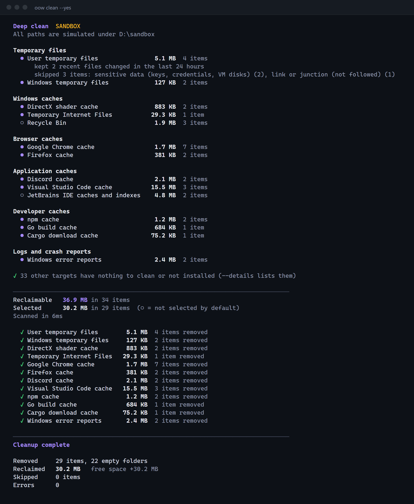
</p>

`oow clean --list` explains every target (what, why it is safe, what happens afterwards).
Opt-in targets such as the Recycle Bin or JetBrains caches are listed but not selected by
default; administrator-only targets are skipped with an explanation unless you run elevated.

## Uninstall, completely

`oow uninstall` finds apps from Windows Installer, regular installers (64-bit, 32-bit and
per-user), the Microsoft Store, Scoop and Chocolatey. It runs **the app's own uninstaller** —
never just deleting its folder — waits for it, verifies the app is gone, and only then looks for
leftovers.

<p align="center">
  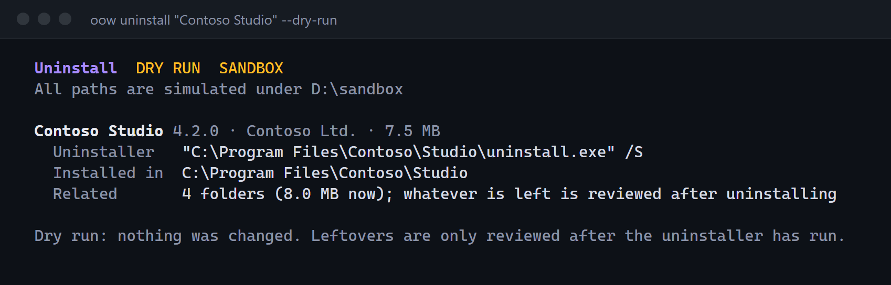
</p>

`oow leftovers` finds folders left by apps removed earlier. Each candidate carries its evidence
and a confidence level; folders still used by installed apps, running programs, services,
startup entries or scheduled tasks are kept. Confirmed leftovers go to the **Recycle Bin**.

<p align="center">
  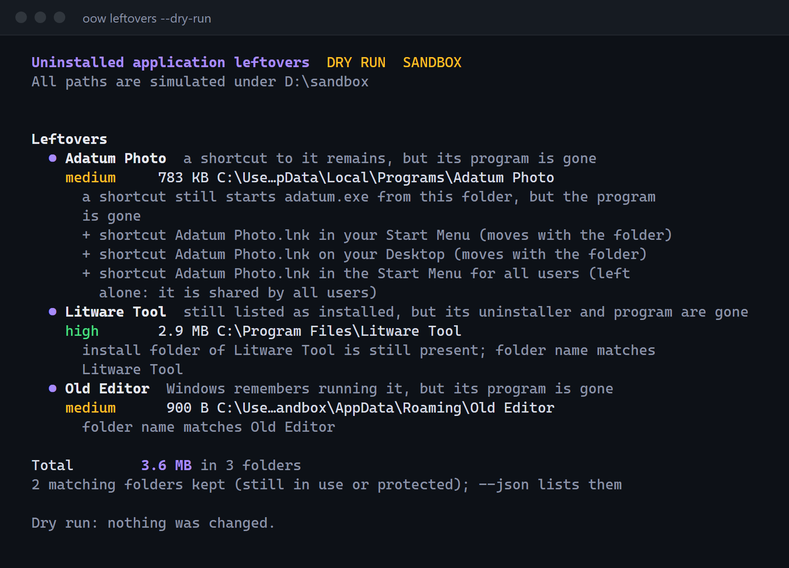
</p>

## Disk analysis

`oow analyze` scans a folder or drive in parallel and opens an interactive explorer: sort,
filter, drill in, list the largest files, and move what you choose to the Recycle Bin. When
its output is piped it prints a summary (and with `--json`, a machine-readable breakdown):

<p align="center">
  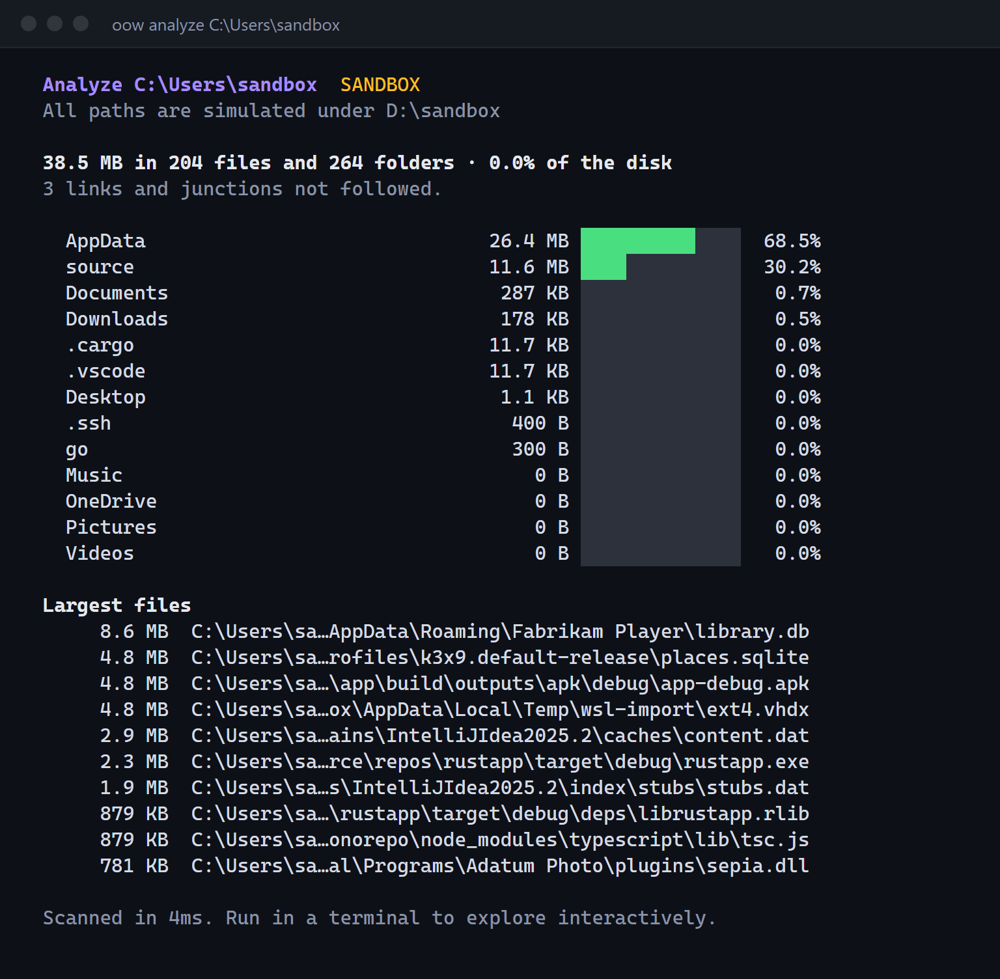
</p>

## Live status

`oow status` is a compact dashboard (per-core view with `c`, process sort with `p`). For scripts,
`oow status --json --watch` streams one snapshot per interval as NDJSON.

<p align="center">
  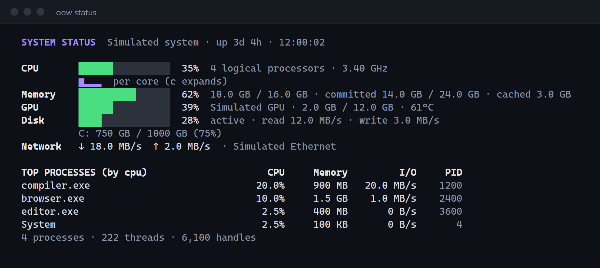
</p>

## Developer artifacts and old installers

`oow purge` finds rebuildable build output and dependency folders — but only next to their
project's marker file (`package.json`, `Cargo.toml`, `*.csproj`…), and never anything Git
tracks, a nested repository, a folder with links, keys or certificates, or one changed in the
last 7 days (those are listed for review). Preselected folders are deleted; folders you add
from review go to the Recycle Bin.

<p align="center">
  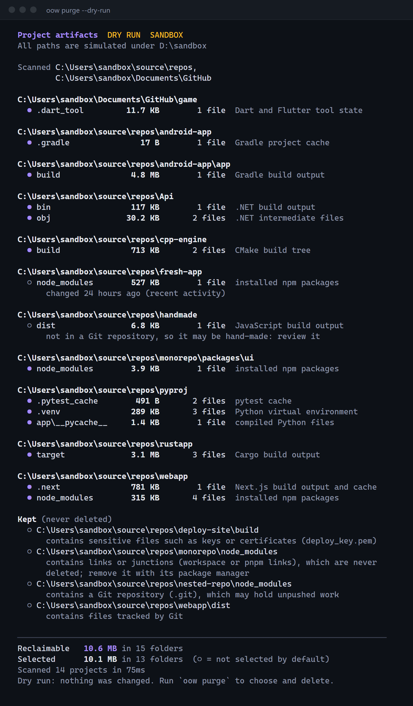
</p>

`oow installer` identifies installer packages by their content (Windows Installer databases,
MSIX manifests, setup-engine data, version resources), never by file name, and preselects only
installers of apps that are installed and older than 7 days. Confirmed packages go to the
Recycle Bin.

<p align="center">
  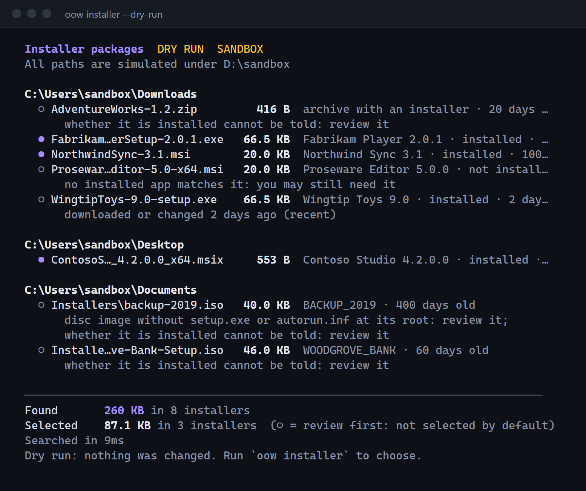
</p>

## Diagnostics and fixes

`oow doctor` only reads: free space, pending restarts, Windows Update, PATH, broken startup
entries, network, permissions and package managers — each with a status and a next step.

<p align="center">
  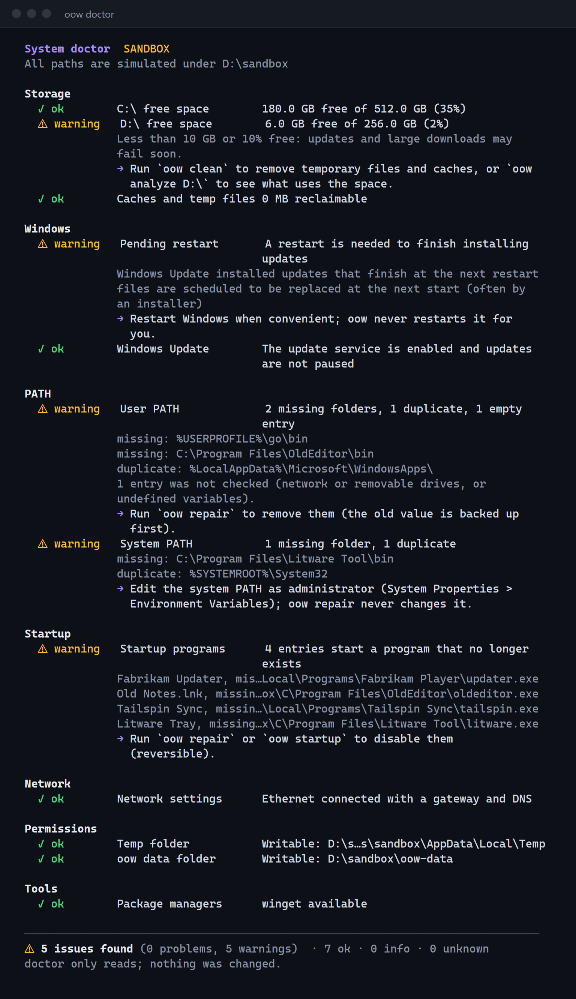
</p>

`oow repair` fixes what doctor finds at user level only: missing, duplicate and empty user PATH
entries (after saving a `.reg` backup) and startup entries whose program is gone. `oow startup`
lists everything that starts at sign-in and disables entries the way Task Manager does, so every
change is reversible. `oow optimize` runs a few bounded maintenance tasks through Windows' own
tools — DNS flush, the Delivery Optimization cache, SSD retrim, and an opt-in component store
cleanup through DISM — and explains each before it runs.

<p align="center">
  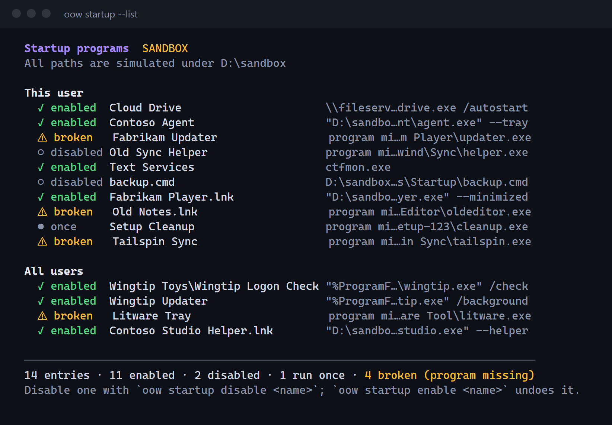
</p>

## Before and after

From the sandbox run above:

```text
Before   oow clean --dry-run       Reclaimable  36.9 MB in 34 items
                                   Selected     30.2 MB in 29 items

After    oow clean --yes           Removed      29 items, 22 empty folders
                                   Reclaimed    30.2 MB    free space +30.2 MB
                                   Skipped      0 items    Errors 0
```

Kept automatically in the same run: 2 temp files changed in the last 24 hours, 2 sensitive files
and 1 junction. `oow history` lists every run afterwards.

## Safe by design

`oow` deletes files on real machines, so it follows **Discover → Explain → Confirm → Act →
Verify** for everything it changes:

- **Narrow, reviewed targets.** Each cleanup rule names its folder, resolved through Windows
  Known Folder APIs (never environment variables), with what it removes, why that is safe and
  what happens afterwards. No wildcards.
- **A guard decides, not the rules.** Drive roots, `Windows`, `Program Files`, `ProgramData`,
  profile and AppData roots, your Documents, Desktop, Pictures and OneDrive, the tool's own data
  and anything you whitelist are refused — including through `..`, `\\?\`, case, trailing-dot and
  8.3 short-name tricks. `oow config protected` lists them all.
- **Verified deletion.** Each item is opened by handle without following links, compared with
  what the scan saw, its final path is checked again, and only then is it deleted through that
  same handle. A file changed after the scan, swapped for a junction or in use is skipped and
  reported.
- **Credentials are untouchable.** SSH and cloud keys, Credential Manager stores, password
  databases, wallets, VM and WSL disks and AI-tool state are never deleted.
- **Recycle Bin for your files.** Uninstall leftovers, installers and folders you pick in
  `analyze` go to the Recycle Bin; permanent deletion is for caches, temp data and rebuildable
  build output.
- **Preview and record.** `--dry-run` everywhere (or `OOW_DRY_RUN=1` to force it); `--yes` is
  required to delete non-interactively; every real run is recorded in `oow history`.
- **No admin unless needed, no tricks.** Administrator-only tasks are skipped with an
  explanation. No registry cleaning, no "RAM boosting", no health scores, no telemetry, no
  background service.

**Limits, plainly:** cache and temp cleanup is permanent (it is limited to data that is
regenerated); item identity is checked by type, size and timestamps rather than file ID; the
free-space change is approximate while other programs write. The full model is in
[docs/SAFETY.md](docs/SAFETY.md) and the review in [SECURITY_AUDIT.md](SECURITY_AUDIT.md).

## Install

**Requirements:** Windows 10 version 1809 or later, or Windows 11, on x64 or ARM64. No
administrator rights and no runtime to install. CI tests every change on Windows Server 2022
and 2025 (x64); ARM64 builds are published but not tested in CI.

| Method | Command |
|---|---|
| PowerShell | `irm https://raw.githubusercontent.com/Harshul1484/out-of-windows/main/scripts/install.ps1 \| iex` |
| Command Prompt | run [`scripts/install.cmd`](scripts/install.cmd) |
| Scoop | `scoop bucket add oow https://github.com/Harshul1484/scoop-bucket` then `scoop install oow/oow` |
| Manual | download `oow-<version>-windows-amd64.zip` (or `arm64`) from [Releases](https://github.com/Harshul1484/out-of-windows/releases) |

The installer picks the build for your CPU, checks its SHA-256 against the release's
`SHA256SUMS` before writing anything (and stops on a mismatch), installs to
`%LOCALAPPDATA%\Programs\oow` and adds that folder to your user PATH. To verify a manual
download:

```powershell
(Get-FileHash .\oow-0.1.0-windows-amd64.zip -Algorithm SHA256).Hash   # compare with SHA256SUMS
gh attestation verify .\oow-0.1.0-windows-amd64.zip --repo Harshul1484/out-of-windows
```

### Update and uninstall

```powershell
oow update --check     # is there a newer release?
oow update             # download, verify the SHA-256, replace oow.exe (old version kept until next start)
oow remove --dry-run   # what uninstalling would remove
oow remove             # remove oow, its PATH entry, and its settings and history (to the Recycle Bin)
```

Copies installed with winget, Scoop or Chocolatey are updated and removed with that package
manager; `oow update` and `oow remove` tell you the exact command.

> [!NOTE]
> **Antivirus false positive.** Microsoft Defender currently flags the x64 `oow.exe` as
> `Trojan:Win32/LummaStealer.DO!MTB`. `oow` contains the names of browser credential files,
> wallets and key stores so that it can *refuse* to touch them, which machine-learning detection
> mistakes for an information stealer. Check the SHA-256 and the attestation above; do not turn
> Defender off. Details and progress: [docs/DEFENDER.md](docs/DEFENDER.md),
> [#18](https://github.com/Harshul1484/out-of-windows/issues/18).

**From source** (Go 1.26+):

```powershell
git clone https://github.com/Harshul1484/out-of-windows
cd out-of-windows
go build -o oow.exe ./cmd/oow
```

## Quick start

```powershell
oow                    # interactive home screen: pick a task by number
oow clean --dry-run    # what would be cleaned, changing nothing
oow clean              # choose targets, confirm, clean
oow analyze            # explore a drive interactively
oow doctor             # a health check that changes nothing
oow history            # what previous runs removed
```

## Usage

```powershell
oow                      # interactive home screen
oow clean --dry-run      # see what would be removed, change nothing
oow clean                # choose targets, confirm, clean
oow clean --list         # every cleanup target with what/why/after explanations
oow clean --rule temp.user --yes      # non-interactive, one target
oow clean --dry-run --json            # machine-readable preview
oow config whitelist add "D:\keep-this" windows.directx-shader-cache
oow config protected     # every location the safety layer protects
oow uninstall            # pick apps, run their uninstallers, review leftovers
oow uninstall --list     # every installed app (registry, Store, Scoop, Chocolatey)
oow uninstall "Contoso Studio" --dry-run   # what would run and what is related
oow leftovers --dry-run  # folders left behind by apps that are gone
oow purge --dry-run      # rebuildable project folders: node_modules, target, .venv, bin/obj, ...
oow purge D:\code        # choose and delete them (Git-tracked, linked and recent folders are kept)
oow config purge add D:\code               # folders purge scans (default: source\repos, Projects, dev, ...)
oow installer --dry-run  # installer packages in Downloads, Desktop and Documents, by content
oow installer            # choose; confirmed installers go to the Recycle Bin
oow analyze              # pick a drive and explore it (enter, backspace, s, f, /, L, d, o, r)
oow analyze --large --min-size 1GB         # largest files
oow analyze D:\Projects --json --depth 2   # machine-readable breakdown
oow status               # live dashboard (c: per-core view, p: process sort, q: quit)
oow status --json --watch --interval 5s    # NDJSON stream for scripts
oow processes --sort memory --top 10
oow doctor               # diagnose free space, restarts, updates, PATH, startup, network (changes nothing)
oow startup              # choose which programs start at sign-in (reversible, like Task Manager)
oow startup disable "Contoso Agent" --dry-run
oow optimize --dry-run   # DNS flush, Delivery Optimization cache, SSD retrim: what, why, effect
oow optimize --task component-store   # opt-in: DISM component store cleanup (administrator)
oow repair --dry-run     # fix user PATH and broken startup entries (PATH backed up first)
oow history              # what was removed and when
```

Global flags: `--json` (stable machine output, see [docs/JSON.md](docs/JSON.md)),
`--no-color` (or set `NO_COLOR`), `--debug` (debug log to stderr).

## Command reference

| Command | What it does | Useful options |
|---|---|---|
| `oow` | Home screen with live CPU, memory and disk, and every task by number | |
| `oow clean` | Temp files, caches and logs that are safe to delete | `--dry-run` `--list` `--rule temp.user` `--all` `--details` `--yes` |
| `oow uninstall [app]` | Run an app's own uninstaller, verify, review leftovers | `--list` `--dry-run` `--id` `--quiet` `--keep-leftovers` |
| `oow leftovers` | Folders left by apps that are gone | `--dry-run` `--yes` |
| `oow analyze [path]` | Interactive disk explorer; summary when piped | `--large --min-size 1GB` `--top 20` `--json --depth 2` |
| `oow status` | Live dashboard | `--json --watch --interval 5s` |
| `oow processes` | Processes with CPU, memory and disk activity | `--sort memory` `--top 10` `--name chrome` |
| `oow purge [folder…]` | Rebuildable developer artifacts | `--dry-run` `--paths` `--yes` |
| `oow installer [folder…]` | Installer packages you no longer need | `--dry-run` `--yes` |
| `oow doctor` | Read-only diagnostics with next steps | `--json` |
| `oow startup` | Programs that start at sign-in; `disable` / `enable` | `--list` |
| `oow optimize` | Bounded maintenance through Windows' own tools | `--dry-run` `--task dns-flush` |
| `oow repair` | Fix user PATH and broken startup entries | `--dry-run` `--yes` |
| `oow history` | What previous operations removed | `--limit 0` |
| `oow config` | Settings, whitelist, protected locations, purge folders | `whitelist add` `protected` `purge add` |
| `oow update` / `remove` | Self-update / uninstall oow | `--check` `--dry-run` |

Exit codes: 0 ok, 1 error, 2 usage, 4 confirmation needed (`--yes`), 130 cancelled.

<details>
<summary>Full <code>oow --help</code></summary>
<p align="center">
  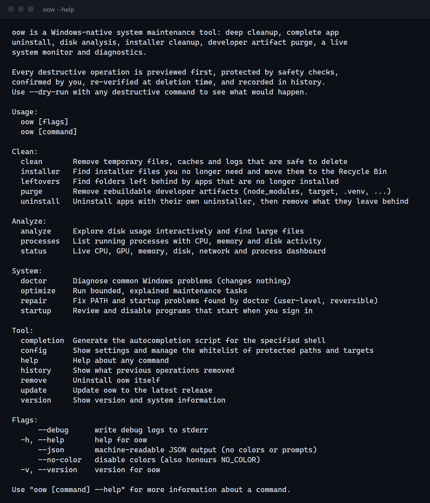
</p>
</details>

## Under the hood

Go, one static binary, native Win32 APIs through `golang.org/x/sys/windows` (no parsing of
localized command output); the TUI uses Bubble Tea and Lip Gloss.

```text
internal/cli          commands, flags, text and JSON output, exit codes
internal/cleanup      declarative rules, read-only scanner, verified executor
internal/safety       path normalization, protected locations, the guard
internal/filesystem   walking without following links, handle-verified delete and recycle
internal/apps         installed apps (registry, Store, Scoop, Chocolatey)
internal/uninstall    native uninstallers, waiting and verification
internal/leftovers    evidence, claims, confidence
internal/analyzer     parallel disk scanner          internal/monitor   live metrics
internal/purge        project artifacts, Git checks  internal/installer packages by content
internal/doctor       read-only checks               internal/repair    user-level fixes
internal/startup      Run keys, Startup folders, scheduled tasks
internal/optimize     DNS, Delivery Optimization, retrim, DISM
internal/sandbox      the simulated Windows layout used by tests and these screenshots
```

More in [docs/ARCHITECTURE.md](docs/ARCHITECTURE.md).

## Philosophy

Maintenance should be boring: exact targets, a preview, your confirmation, and a record of what
changed. `oow` would rather keep a file than delete one it cannot prove is safe, and it says
which and why. It is not a "PC optimizer", a registry editor or a background service.

## Roadmap

**Available now (v0.1.0):** everything above.

**Planned:** winget and Chocolatey packages ([#13](https://github.com/Harshul1484/out-of-windows/issues/13)),
code-signed releases ([#15](https://github.com/Harshul1484/out-of-windows/issues/15)) and
clearing the Defender detection ([#18](https://github.com/Harshul1484/out-of-windows/issues/18)).
Progress is on the [project board](https://github.com/users/Harshul1484/projects/6).

## Contributing

```powershell
go build ./...
go test ./...                                    # sandboxed: never touches your system
go run ./cmd/oow sandbox init .sandbox\demo      # a simulated Windows layout
go run ./cmd/oow --sandbox .sandbox\demo clean   # try any command against it
```

`gofmt`, `go vet ./...` and `go test ./...` must pass. Tests create files only under the
git-ignored `.sandbox/`, behind a deletion fence, and CI runs everything on disposable Windows
VMs, including a real cleanup guarded by canary files. Defender may quarantine some test
binaries locally (#18); CI runs the full suite. See [CONTRIBUTING.md](CONTRIBUTING.md) and the
project contract in [AGENTS.md](AGENTS.md); report vulnerabilities privately as described in
[SECURITY.md](SECURITY.md).

## License

[MIT](LICENSE)
