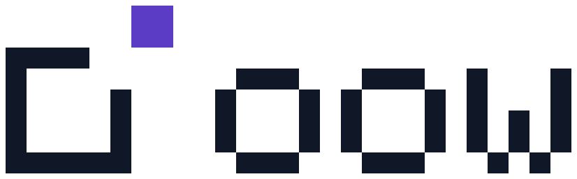

# oow brand

  <picture>
    <source media="(prefers-color-scheme: dark)" srcset="oow-lockup-dark.svg">
    
  </picture>

## The mark

**Exit Pane.** A window frame whose top-right corner is open, and the block that belonged there
already outside it: what doesn't belong goes out of the window. It names the product without
drawing it, and nods to Windows without using its logo.

The mark and the `oow` wordmark are drawn on one pixel grid (the mark is 8×8 cells, the
wordmark 5 cells tall, set on the frame's baseline two cells to the right). Every file here is
traced from that grid, and the CLI draws the same grid with half-block characters
(`internal/ui/logo.go`), so the terminal logo *is* the logo. `TestLogoMatchesBrandAssets`
fails if the two drift apart.

## Files

| File | Use |
|---|---|
| `oow-symbol.svg` / `oow-symbol-dark.svg` | The mark on light / dark backgrounds |
| `oow-lockup.svg` / `oow-lockup-dark.svg` | Mark + wordmark, horizontal (README header, docs) |
| `oow-lockup-stacked.svg` / `-dark.svg` | Mark above wordmark (square spaces) |
| `oow-symbol-black.svg` / `oow-symbol-white.svg` | One-colour (print, embossing, single-ink) |
| `oow-symbol-16.svg` | Pixel-exact small cut: 2 px per cell at 16 px, no margin |
| `icons/oow-icon-{16,32,48,256}.svg/.png`, `icons/oow.ico` | App icon (mark on an ink tile, whole pixels at every size); embedded in `oow.exe` |
| `oow-social-preview.png` | 1280×640 card for links (repository Settings → Social preview) |
| `oow-terminal.txt` | The terminal rendering, exactly as the CLI prints it |

## Colour

| Name | HEX | RGB | Use |
|---|---|---|---|
| Ink | `#101828` | 16, 24, 40 | Frame and wordmark on light backgrounds; icon tile |
| Violet | `#5B3CC4` | 91, 60, 196 | The escaped block on light backgrounds (7.3:1 on white) |
| Mist | `#E6E8EE` | 230, 232, 238 | Frame and wordmark on dark backgrounds |
| Lilac | `#A78BFA` | 167, 139, 250 | The escaped block on dark backgrounds (6.9:1 on #0D1117) |

Only the block that left the frame carries the violet; everything else is ink (or mist). The
violet is also the CLI's accent colour (`internal/ui/theme.go`). The one-colour versions work
on their own: colour is never needed to recognise the mark.

## Clear space and size

- **Clear space:** at least one cell (1/8 of the mark's height) on every side; for the lockup,
  one cell of the same size.
- **Minimum size:** mark 16 px (use `oow-symbol-16.svg` or the icon set below 48 px, never a
  scaled-down master, so cells stay whole pixels); horizontal lockup 96 px wide.
- **Terminal:** the lockup is 27 columns × 4 lines, the mark 8 × 4. The CLI shows it on the home
  screen and in `oow version` on a terminal only; piped and `--json` output never include it.

## Don't

- Don't round, outline, rotate, tilt or add shadows or gradients to the cells.
- Don't move the block back into the frame, change its position or size, or recolour the frame
  violet.
- Don't set the wordmark in a font: it is the pixel `oow` from the grid.
- Don't place the colour version on mid-tones where ink or violet lose contrast; use the
  one-colour black or white version instead.
- Don't redraw the terminal logo by hand; change the grids in `internal/ui/logo.go` and
  regenerate these files together.

## Changing the icon in oow.exe

The icon PNGs are copied to `cmd/oow/winres/` and listed in `winres.json`. After changing them,
run `go generate ./cmd/oow` and commit the updated `rsrc_windows_*.syso`; CI fails if they are
stale.
